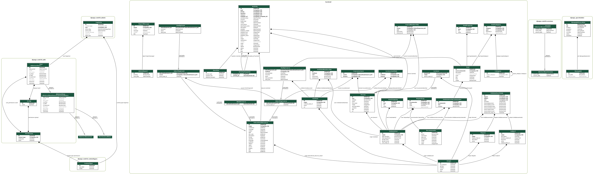

apps.backend package
=====================================

Subpackages
-----------

.. toctree::
    :maxdepth: 4

    apps.backend.management
    apps.backend.migrations

Submodules
----------

apps.backend.admin module
------------------------------------------

.. automodule:: apps.backend.admin
   :members:
   :undoc-members:
   :show-inheritance:

apps.backend.api\_views module
-----------------------------------------------

.. automodule:: apps.backend.api_views
   :members:
   :undoc-members:
   :show-inheritance:

apps.backend.apps module
-----------------------------------------

.. automodule:: apps.backend.apps
   :members:
   :undoc-members:
   :show-inheritance:

apps.backend.models module
-------------------------------------------

.. automodule:: apps.backend.models
   :members:
   :undoc-members:
   :show-inheritance:

apps.backend.tests module
------------------------------------------

.. automodule:: apps.backend.tests
   :members:
   :undoc-members:
   :show-inheritance:

apps.backend.urls module
-----------------------------------------

.. automodule:: apps.backend.urls
   :members:
   :undoc-members:
   :show-inheritance:

apps.backend.utils module
------------------------------------------

.. automodule:: apps.backend.utils
   :members:
   :undoc-members:
   :show-inheritance:

apps.backend.views module
------------------------------------------

.. automodule:: apps.backend.views
   :members:
   :undoc-members:
   :show-inheritance:

Module contents
---------------

.. automodule:: apps.backend
   :members:
   :undoc-members:
   :show-inheritance:
